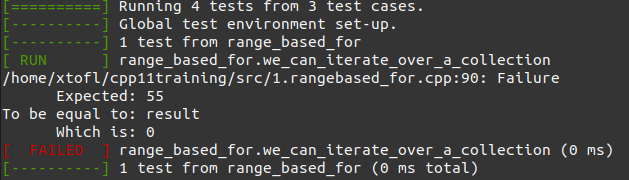

# Exercises for the masses

## History

Working in C++ around the year 2010 was very exciting. The language was about
to receive some vast new impulses, promising better semantics, performance, …

In 2016, I was lucky enough to work in an environment that lived on the edge:
constantly following the latest (Microsoft) compiler versions, and writing C++
programs according to the latest and greatest idioms.

All of this happiness had to be shared. That’s why my employer, Sioux Embedded
Systems, asked if anyone would be able to create a C++11/14 ramp-up course for
my colleagues. Of course I bit.

The budget: 5 days of preparation - a challenge for me. It seemed a vast
undertaking, given the fact that I hadn’t been giving training, nothing ‘free’
could be found. So I decided I would borrow free and open source presentations,
and create exercises myself. But how?

As it happened, there also was a gap in the knowledge of unit testing
frameworks. So why not kill two birds with one stone? Fond of TDD, I had grown
quite familiar with the googletest framework. So I decided to create a bunch of
failing unit tests that had to be ‘fixed’ using C++11/14 features.

Since I was to take all my course material from the internet, I thought it only
fitting to give back. So I started creating the course in the open on
https://github.com/xtofl/cpp11training/.

## Overview

### Repo structure

* Presentations are stored in the `slides/` directory. There's also a
  [readme](slides/README.md) to explain its contents.
* Exercises are stored per topic under the `src/` folder; within each topic,
  exercise source files are numbered.
* Each topic file contains a number of `TEST` cases.  Each of these cases represents
  an exercise.  In the comments, I try to explain what you're supposed to do (TODO),
  what you're supposed to learn from this exercise (GOAL), and may add some HINTs.

### Exercise Example

For instance, one of the first exercises you'll encounter is about using the
range-based-for feature introduced in C++11.

```c++
TEST(range_based_for, DISABLED_we_can_iterate_over_a_collection)
{
    int result = 0;
    // TODO: extend the Range class so that it acts as a
    // real 'range' and can be used in a range based for loop.
    //
    // GOAL: understand the working of range-based for loop, and
    // adapt existing classes to it
    //
    // HINT: This is a harder problem: you need to provide
    // a free begin(const Range&) and end(const Range&) function
    // that returns an iterator-like object.
    //
#ifdef solv
    for (const auto &element : Range{ 1, 11 })
    { 
        result += element;
    }
#endif
    EXPECT_EQ(55, result);
}
```

As you'll see, the test will
be compiled, but the `DISABLED_` prefix in its name will prevent gtest from
executing it.  Removing the prefix 'activates' the test and makes it run,
but fail:



Another example: one to learn using the `transform` algorithm:

```c++
TEST(apply_transform, DISABLED_join_two_input_ranges)
{
    const std::vector<std::string> keys{ {"two", "five", "ten", "forty"} };
    const std::vector<int> values{ {2, 5, 10, 40} };

    std::vector<std::string> numbers;
    // TODO: transform keys and values into
    // this python-key-value syntax
    // GOAL: see that `transform` can accept two ranges
    // and 'zip' them together
    ASSERT_EQ(keys.size(), numbers.size());
    EXPECT_EQ("two: 2", numbers[0]);
    EXPECT_EQ("five: 5", numbers[1]);
    EXPECT_EQ("ten: 10", numbers[2]);
    EXPECT_EQ("forty: 40", numbers[3]);
}
```

## Future

Meanwhile we're 2020, and I have given this training about 5 times. Everytime,
the overall response is positive about offering running code in the form of
isolated unit tests. The fun part for me is that whenever someone finds a
mistake, I can kindly ask them to fix it and create a merge request.

And it has proven to be needed. What is also needed: some of the exercises are
a little 'far fetched', and may be replaced by more down to earth subjects.
Although on every occasion I am able to improve the guidelines, add some
exercises and the lot, this body of exercises still needs a lot of guidance.

I'm hoping that some day, this effort will be picked up and improved by 'the
masses'. For I'm convinced that good and affordable programming education is
an important ingredient for an inclusive world.