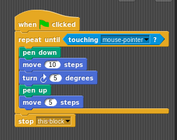

<!-- .slide: style="text-align: left;"> -->

title: Function Signature Design
<span style="font-size:.4em; margin-right:0">v0.1</span>

author: Kristoffel Pirard

url: https://github.com/xtofl/cpp11training/blob/add-function-signatures-workshop/slides/function_signature_design/function_signature_design.md
style: sioux.css

<div style="font-size:.4em">
[single-page version](/?print-pdf&pdfSeparateFragments=false)
</div>

<div style="font-size:.4em">
This slide deck is intended for use with reveal.js;
</div>
<div style="font-size:.4em">
```
articles> make function_signature_design/function_signature_design.reveal
```
</div>

---

# Function Signature Design


 <!-- .element: width="300" style="display: block; margin-left: auto; margin-right: auto;" -->
<div style="font-size:.4em">credit: snap!</div>

--

## What Others Say...

* [API design](https://static.googleusercontent.com/media/research.google.com/en//pubs/archive/32713.pdf) (Joshua Bloch, Java)
* [CppCoreGuidelines F:Functions](https://isocpp.github.io/CppCoreGuidelines/CppCoreGuidelines#S-functions)
* ... (to be continued)

This presentation focuses on the tools and the thought process.

---

## Context

* Why do we have functions
* Structured Programming
    * => a tool for the user
    * 'Structure' = divide and conquer
        * -> how fine?  how coarse?
        * how evenly?
        

--

### Notation

(TODO: find better name for 'our_function')

* No more ~~foo~~ and ~~bar~~
    * `ret_t our_function(arg_t)`
    * ```
    void client_code() {
        ...
        auto x = our_function(a);
        ...
    }```

--

## Rationale

* why bother?
    * readability/learnability/usability
    * who's the audience?

--


### Goals of the Function Signature

* what is the essence of the function
* indicate some non-functional aspects:
    * sync/async
    * side effects
    * error handling indications

--

### Audience

* new code/maintenance
* reading/writing
* lib author/user
* finding/learning/using

-- 

### Audience

* client view: make it
    * easy to use => client code clutter
    * easy to understand => client code correctness
    * easy to learn => reusability
* maintainer view
    * make it easy to adapt => maintainability

--

### Goal

Make the essence of the function

* as clear as possible
* to all needed parties
* in all needed situations

With the tools we have at our disposal

---

## Our Tool Belt

* types
* names
* audience interaction
* (documentation)

--

### Types

* type signatures
    * built-in, library, custom
    * error handling indications

--

### Names

* naming
    * sync/async: `auto t = transact_async(...)`?
    * argument roles
        * `transact(Account from, Account to)`

--

### Audience Interaction

* knowing the audience
    * contextual, implicit, domain knowledge
    * level of expertise
* testing with the audience
    * :) or :( on first encounter?

--

### Documentation

is out of scope here: we want to limit it to describe the "why"

But: studies show that without _good_ and _comprehensive_ documentation,
reuse is not very likely.

---

## Types Convey Meaning

* What
    * type
    * qualifiers
* Where
    * argument type + qualifiers
    * member function qualifiers
    * return type + qualifiers

Note: parameters = signature <-> arguments = call+implementation

--

### Type: a Taxonomy

* C++
    * Built-in
    * Standard
* Library
* Domain <--- probably you need these

--

### Vocabulary Types

For expressing a pattern

* Ownership: `std::unique_ptr`
* An error happened: `std::expected<E, T>`
* A collection: `vector`, `map`, ...
* Decouple timing: `future<T>`, `task<T>`
* Decouple iteration: `range`, `iterator`

These have counterparts in every language.

--

### Stick to the Domain

Why?

* maximal compiler error checking
    * `auto x = get(matrix, 4, 2)` You're screwed.
    * `auto x = get(matrix, Row{2}, Col{4})`
* little (textual!) overhead, no run-time overhead
* cohesion
    * `pump::state what_if(pump, event)`
    * `int what_if(pump, char)`

--

### Domain Types (1/2)

AKA Semantic/Meaningful/Strong types

```
int remove_needle(MyStringType&, const char*, int&);

int error = 0;
auto removed = remove_needle("a b c d b", "b", error);
if (!error) cout << "removed " << removed << "\n";
```
What???

```
struct removed { std::string result; int occurences; };
optional<removed> remove_from(
    const std::string&,
    const std::string&);

remove_from("a b c d b", "b").and_then(
    [](auto &&removed) {
        cout << "removed " << removed.occurences << "\n";
    }
).or_else([]{});
```
Ah... Ok.

--

### Domain Types (2/2)

Advice: build domain types

* however small; they'll help later!
* built-ins are for
    * storage
    * utter performance
    * platform dependencies
    * adapting to foreing functions
* domain types are for
    * meaning


--

### Qualifiers

* const, volatile
* value, ref, pointer, rvalue-ref

--

### Const vs. Immutable

`const X& x` means: _you_ aren't going to change it.

This is often confused.

If it's not yours, somebody may change it!

Need immutable?  Ask for a copy!

--

### Argument passing

* Value (preferably) / copy
    * thread-safe!
* `&&` Rvalue-ref
    * Ownership / performance
* `const &` const reference
    * same instance
    * ! lifetime = _your_ job
* `*` pointer
    * meaning: Non-Owning ()
    * ! lifetime = _your_ job

--

### Pointer Passing

[GotW 91](https://herbsutter.com/2013/06/05/gotw-91-solution-smart-pointer-parameters/)

--

```
void handle_events(shared_ptr<Widget> w);
```

--

Does `handle_events` use the `shared_ptr` functions?

Probably only dereferencing

=> Why not `handle_events(Widget &w)`?

* reduce coupling
* greatly reduce risk of spoiling ownership
* limit responsibilities:
    * ownership
    * widget twiddling

--

### A Taxonomy of Pointer Arguments

* ownership
* access

--

### Ownership Arguments

```
void our_function(owning_type<T>)
```

* `unique_ptr`: transfer ownership
    * argument => "sink" function
    * return value => "source" function
* shared => ... shared ownership
    * sometimes forced by library: tasks, async, ...

--

### Ownership by Reference

```
void our_function(owning<T> &)
```

our function can

* ref count
* validity
* create weak ref
* copy it
* CHANGE IT!? (use `const &` by default)

Mostly _not_ what is intended

--

### Pointer Arguments: Access

`our_function(T &)` (or `const &`)

--

### Pointer Arguments: Raw Pointers?

* expresses 'maybe null'
    * => always check!
    * alternative: continuation passing style with optional/future/...
* as return value: an element of an array
* no other meaning without better alternative


---

## Expressing Errors

Standard C++: exceptions

But... 50% of respondents use -fno-exceptions (cf. [Optional is Not a Failure (Phil Nash)](https://www.youtube.com/watch?v=iWDjoD3MdXs))

So what's left?

--

### Optionals

Simple: it works or it didn't

```
optional<unique_ptr<Widget>> create(WidgetName);

auto w = create("EditBox");
if(w) { w->defaultValue("xxx"); }
```

--

### Expected (C++20)

```
expected<MyErr, Widget> create(WidgetName);

auto w = create("EditBox");
if(w) { w->defaultValue("xxx"); }
```

---

## Naming is Hard

* explain what it does
    * to your colleague
    * to your dad
    * to your kid

--

### The word type

* Noun
* Verb
* Adjective

--

### Word type: Noun


* immutable
* pure
* object?

--

### Wordt Type: Verb

* action
* side-effect
* non-pure

--

### Wordt Type: Adjective

* property
* predicate
    * replace `isBig()` with `big()`
    * replace `hasX()` with `optional<X> x()` or `withX(callback)`

--

### Roles vs. Types

* `power_consumption(const Machine &machine)`
    * duplication!
* `get_first(const std::vector<X> &xs)`

--

### Words from the Same Domain

"Symmetry"

* fish in the same pont
    * begin/end start/stop first/last
    * more examples?
* even level of abstraction


--

### Context avoids Repetition

* `math::sin` vs. `confession::sin`
* `myMachine.startMachine()`???

--

### C++ has Overloads!

context is provided by the argument type

* Argument Dependent Lookup
* conversions _from_ `X`
    * `operator R() () const`
    * `auto r = static_cast<R>(x)`
* conversions _to_ `X`
    * `static X from(int i)`
    * `auto [xi, xs] = X::from(10), X::from("10")`

--

### C++ conventional functions

* indexing with `operator[]`
* calling with `operator()`
* comparing with `operator <=>()`
* ...

---

## The Non Functional Aspects

* sync/async
* side effects
* error handling indications

---

## Testing the Signature

--

### Design Time

* Time to find a proper name
* Long time => wrong abstraction?
* Tools for validation
    * Rubber Duck
    * Polls

--

### Review Time

* One Shot opportunity for "learnability"
    * => Pay Attention!
* What questions are asked
    * Missing context?
    * Ambiguity?
    * "Too smart"?
* What is unclear
* "Taste" vs. reality

--

### Life Time

Bugs occuring from this signature?

Anticipate api evolution

* e.g. `X from_database(db)`
    * `X v1::from_database(db)`
    * `X from_database(v1::db)`

---

## Conclusion

* Know your Goals
* Know your Audience
* Use the Tool Belt
* Naming is Hard
    * => Test it

